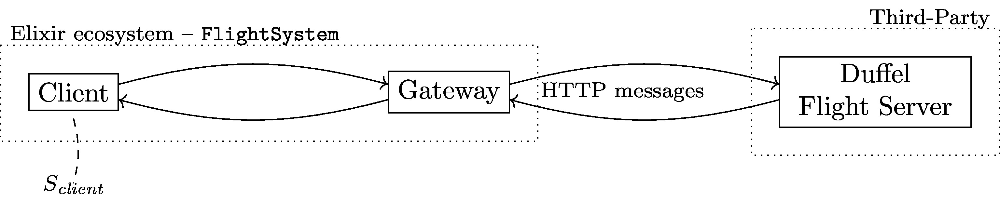
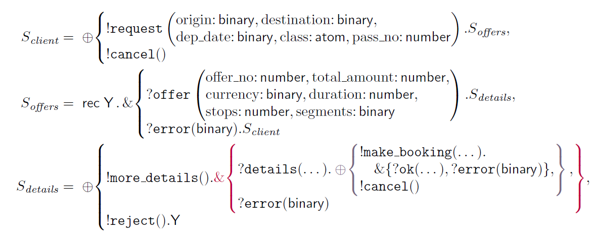

# FlightService

Flight service in Elixir using [Duffel API](), where the interactions are session-typed using [ElixitST](github.com/gertab/ElixirST).

The flight service module is structured as follows where a client communicates (via a gateway) to an external third party server.




The client process is statically verified with respect to the session type $S_{client}$ using the ElixirST tool.




## Running the example
Open the Elixir shell and compile the example as follows.
```
iex -S mix
```

Execute example directly by running `FlightClient.main` or spawn a client and gateway process manually using the `ElixirST.spawn/4` function:

```
ElixirST.spawn(
  &client/6, 
  ["MLA", "CDG", "2022-11-24", :economy, 2], 
  &FlightGateway.gateway/1, 
  [])
```

## Authentication

Obtain a Duffel API key from [duffel.com](https://duffel.com) and create a file called `dev.secret.exs` in the config folder contain the following:

```
use Mix.Config

config :flight_service,
  duffel_access_token: "duffel_test_secret_key..."
```

## Licence
This project is licenced under the GPL-3.0 [licence](LICENCE).

<!-- 
## Installation

If [available in Hex](https://hex.pm/docs/publish), the package can be installed
by adding `flight_service` to your list of dependencies in `mix.exs`:

```elixir
def deps do
  [
    {:flight_service, "~> 0.1.0"}
  ]
end
```

Documentation can be generated with [ExDoc](https://github.com/elixir-lang/ex_doc)
and published on [HexDocs](https://hexdocs.pm). Once published, the docs can
be found at <https://hexdocs.pm/flight_service>.
 -->
